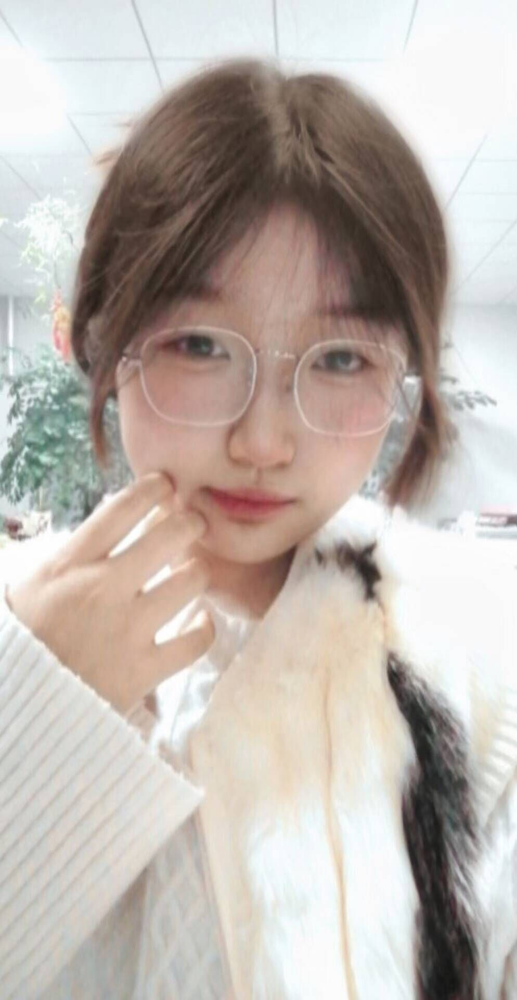
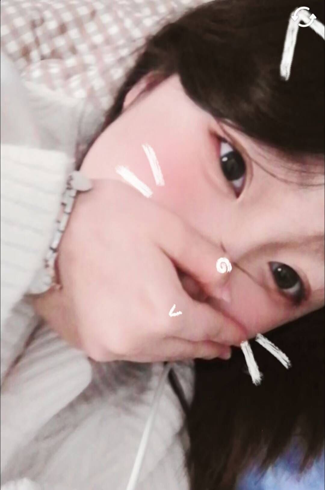
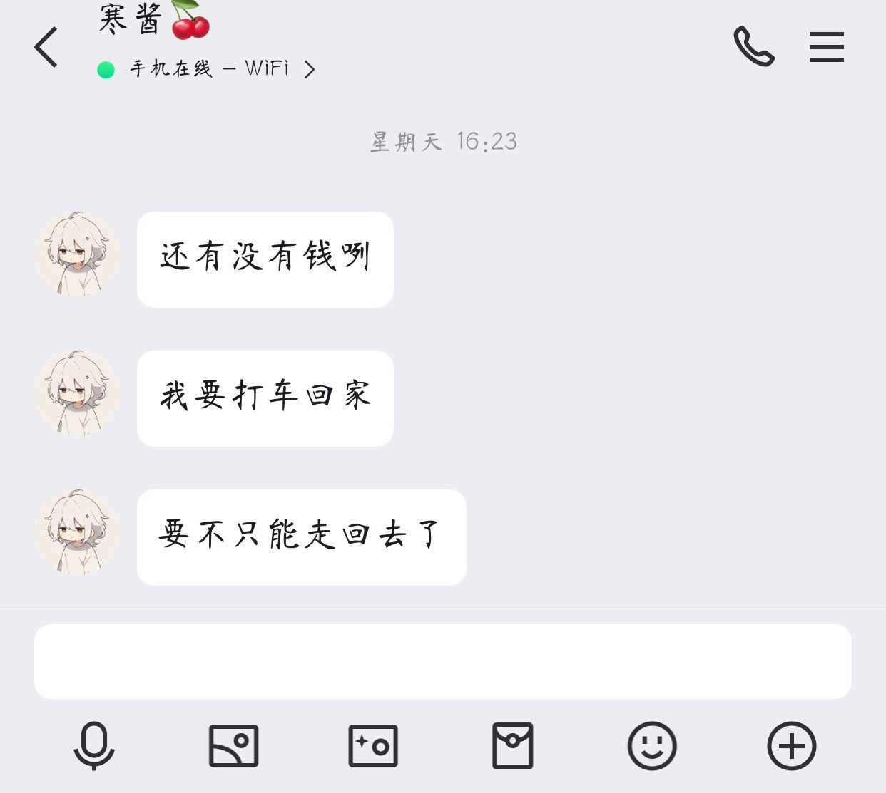
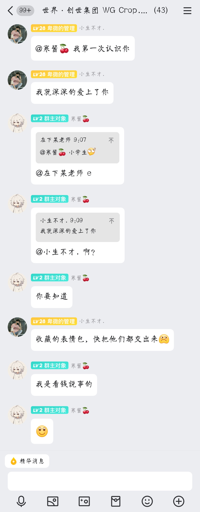
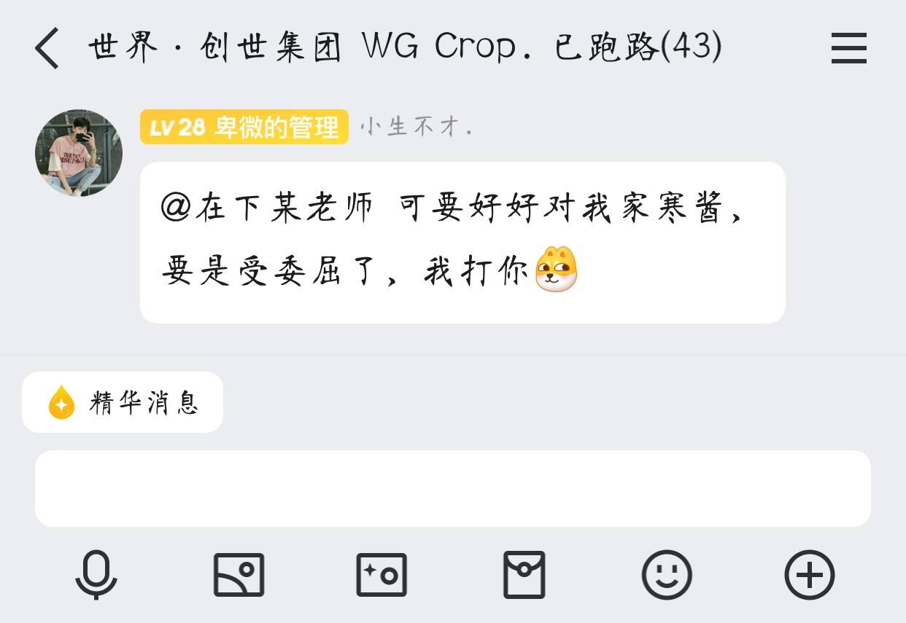

# a-story-of-hanjiang-eunuch
a story of hanjiang eunuch

# 第一章：寒酱的欺诈

在一个遥远的地方，有一个充满奇幻色彩的国度——猪羊国。这里住着一群会说话的动物，他们和睦相处，过着简单而快乐的生活。然而，在这片宁静的土地上，有一个名叫寒酱的太监，他与众不同。

寒酱是一个狡猾而又贪婪的人物，他唯一的爱好就是钱。为了满足自己无尽的贪欲，寒酱常常设计各种骗局，骗取小伙伴们手中的财物。

在猪羊国的一片草地上，有一群天真无邪的小动物们，他们是寒酱的目标。小猪佩奇、小羊苏西和其他小伙伴们经常聚在一起玩耍，他们彼此之间有着深厚的友谊。然而，寒酱却利用这一点，编织了一个又一个谎言。

有一天，寒酱来到了小伙伴们经常聚集的草地。他假装一副愁眉苦脸的样子，吸引了小猪佩奇和小羊苏西的注意。“哎呀，你们看我这样子，是不是出了什么事？”寒酱故作伤心地说。

小猪佩奇和小羊苏西关切地围了上来，询问发生了什么事情。寒酱编造了一个故事，说他今天去城里的时候忘记带钱了，现在没钱打车回家，非常担心回不了家。

“我今天真的太粗心了，不小心把钱包落在家里了。”寒酱装出一副无助的样子，“如果没有钱打车，我恐怕今晚得走回去，那可真是太远了。”

小伙伴们听到寒酱这么说，都十分同情他。小猪佩奇和小羊苏西立刻掏出了自己的零花钱，尽管这些钱对他们来说非常重要，但为了帮助寒酱，他们还是毫不犹豫地递给了他。

“拿着吧，寒酱，这应该够你打车回家了。”小猪佩奇说道。

小羊苏西也补充道：“我们都知道你是个好人，所以不用担心，我们会帮你的。”

寒酱接过钱，假装感激涕零：“谢谢你们，真是我的好朋友们！”

实际上，寒酱根本没有忘记带钱包，这一切都是他精心设计的一个骗局。他心里暗自得意，因为他又成功地骗取了小伙伴们的钱财
# 第二章：真相大白

自从寒酱成功骗走了小猪佩奇和小羊苏西的钱之后，他变得更加肆无忌惮起来。他开始频繁地使用类似的借口，甚至开始编造更加离奇的故事来骗取更多的钱财。然而，随着时间的推移，小伙伴们开始对寒酱的行为产生了怀疑。

一天，寒酱又来到了小伙伴们经常聚集的草地。这一次，他一脸愁容，似乎有什么烦心事。“哎呀，你们看我这样子，是不是出了什么事？”寒酱故作伤心地说。

小猪佩奇和小羊苏西关切地围了上来，询问发生了什么事情。寒酱编造了一个新的故事，说他今天去城里的时候忘记带钱包了，现在没钱买吃的，非常饿。

“我今天真的太粗心了，不小心把钱包落在家里了。”寒酱装出一副无助的样子，“我现在肚子饿得咕咕叫，想吃一碗面、一个鸡腿和一块年糕，可是足足要69元。”

小伙伴们听到寒酱这么说，都十分同情他。然而，这一次，小羊苏西却没有立刻掏出钱来。她想起前几天寒酱也用过类似的借口，从她和佩奇那里骗走了钱。

“寒酱，你确定你真的没有钱吗？”苏西问道。

寒酱立刻回答：“当然没有，不然我也不会这么着急啊。”

苏西心中充满了疑问，但她没有直接揭穿寒酱，而是提议大家一起想办法帮助寒酱。“那我们一起去村里的面馆看看，说不定老板会给我们打折的。”

小伙伴们一起去了村里的面馆。在那里，小狗乔治也加入了他们。乔治告诉他们，寒酱刚刚向他借了一笔钱，理由是他的钱包被盗了，需要钱购买回家的火车票。这个消息让佩奇和苏西感到非常惊讶，因为不久前寒酱才刚用过同样的借口从他们那里骗走了钱。

“这怎么可能呢？他不是说他只是忘了带钱包吗？”佩奇疑惑地说。

苏西也表示不解：“是啊，而且他上次说他是坐出租车来的，怎么会突然需要火车票呢？”

小狗乔治也表示困惑：“我也不知道是怎么回事，但我记得他上次也是这么说的。”

小伙伴们开始意识到寒酱的行为有些可疑。苏西决定采取行动，她悄悄地告诉佩奇和乔治：“我觉得我们应该调查一下寒酱，看他到底在做什么。”

佩奇和乔治点头同意。于是，小伙伴们开始秘密地搜集证据，试图揭开寒酱的真实面目。

#第三章：揭露真相

小伙伴们开始怀疑寒酱的行为，并决定采取行动来查明真相。小羊苏西、小猪佩奇和小狗乔治组成了一个小队，他们决定秘密地搜集证据，以证明寒酱的欺诈行为。

苏西首先建议他们先去调查寒酱的日常活动。他们注意到寒酱总是独自一人出现在不同的地方，每次都会以各种借口请求帮助。佩奇提议跟踪寒酱，看看他究竟在做什么。

第二天，小伙伴们决定分头行动。佩奇和乔治负责跟踪寒酱，而苏西则留在村里打听更多关于寒酱的信息。

佩奇和乔治跟随着寒酱的脚步，发现他并没有像他说的那样去寻找食物或者回家，而是去了一个偏僻的地方。在那里，寒酱拿出了一堆钱，数了起来，脸上露出了得意的笑容。这让佩奇和乔治非常震惊。

同时，苏西也在村子里打听到了一些信息。她得知寒酱曾经多次以同样的借口向不同的小伙伴借钱。其中最让人心酸的是，鸡蛋和在下某老师，他们几乎是倾其所有，将自己仅剩的几角钱一分一分地转给了寒酱，希望能帮助他渡过难关。然而，寒酱却觉得这些钱太少，根本不放在眼里。

小伙伴们决定将这些证据汇总起来，并计划在国王面前揭露寒酱的真面目。他们知道，只有国王才有权对寒酱进行正式的审判。

几天后，小伙伴们带着收集到的证据来到国王面前。他们向国王讲述了寒酱的欺诈行为，并展示了他们搜集到的证据。国王听后非常震惊，立即下令召见寒酱。

寒酱被带到国王面前时，依然保持着一副无辜的表情。然而，当小伙伴们一一出示证据，并讲述他们的经历时，寒酱再也无法掩饰自己的真实面目。他试图为自己辩解，但证据确凿，无法抵赖。

国王对寒酱的行为表示强烈的谴责，并宣布将对他进行审判，以确定合适的惩罚
#第四章：审判与惩罚

寒酱被国王传唤到王宫接受审判。国王坐在高高的宝座上，严肃地看着寒酱，周围站着小羊苏西、小猪佩奇、小狗乔治以及其他小伙伴们，他们手里拿着收集到的证据。

国王开口说道：“寒酱，你被指控欺诈和欺骗猪羊国的居民。小伙伴们已经提供了足够的证据来证明你的罪行。你有什么要说的吗？”

寒酱试图为自己辩解：“陛下，我只是暂时遇到了困难……”

“困难？”国王打断了他的话，“你所谓的‘困难’就是欺骗无辜的居民，骗取他们的钱财吗？”

寒酱沉默了一会儿，然后低下头，不再说话。他知道自己的谎言已经被拆穿，无法再辩解。

国王继续说道：“小伙伴们告诉我，你甚至从鸡蛋和在下某老师那里骗取了他们仅剩的几角钱。他们几乎倾其所有，而你却觉得这些钱太少。这种行为不仅违法，而且极其不道德。”

小伙伴们纷纷上前，讲述了自己的遭遇。小猪佩奇说：“寒酱曾告诉我们他没钱打车回家，但我们后来发现他根本就没有离开过村子。”

小羊苏西补充道：“他还说过他没钱吃饭，需要一碗面、一个鸡腿和一个年糕，足足要69元。但事实上，他根本没有去吃东西，而是在一个偏僻的地方数钱。”

国王听完所有证词后，深深地叹了口气。“寒酱，你的行为不仅伤害了这些无辜的孩子们，也玷污了猪羊国的名声。现在，我必须对你做出判决。”

国王宣布了对寒酱的判决：
- **剥夺权利**：取消寒酱在猪羊国的所有特权。
- **赔偿损失**：寒酱必须归还所有骗取的财物，并赔偿受害者的经济损失。
- **劳役**：寒酱将被判处一段时间的强制劳役，以此作为对猪羊国的补偿。
- **社会排斥**：如果寒酱不能改正自己的行为，他将被永久驱逐出猪羊国。

寒酱听后，面如死灰，他知道自己的行为给自己带来了严重的后果。小伙伴们看到寒酱受到了应有的惩罚，感到宽慰的同时也感到了一丝悲伤，因为他们曾经试图帮助寒酱，但他却选择了背叛
# 第五章：逃往世界·创世集团

寒酱在接受审判后，并没有真正认识到自己的错误。相反，他开始策划逃跑，并找到了一个新的目标——世界·创世集团。这是一个虚拟世界平台，许多用户都在这里创建和管理自己的社区。

寒酱偷偷离开了猪羊国，来到了世界·创世集团。他很快就找到了一个可以利用的漏洞，通过一系列复杂的操作，他获得了管理员权限。有了这些权限，寒酱开始在平台上捣乱。

有一天，寒酱遇到了在下某老师，一位在世界·创世集团中备受尊敬的用户。某老师曾经帮助过很多新用户，深受大家的喜爱。寒酱看到了一个机会，他决定利用管理员权限对付某老师。

寒酱先是编造了一系列的谎言，试图让其他用户相信某老师做了坏事。当这些谎言未能奏效时，寒酱采取了更极端的措施。他利用管理员权限，将某老师踢出了平台，并将其账号拉黑，这意味着某老师无法再登录世界·创世集团。

某老师的朋友们很快发现了这件事，他们开始调查原因。通过一些线索，他们怀疑寒酱可能是背后的操纵者。他们决定向平台管理者报告这一情况，并请求恢复某老师的账号。

# 后序：正义的反击

#### 第一节：利用姿色获得权力

寒酱被世界·创世集团的管理者封禁后，并没有放弃。他开始寻找新的途径来获取权力。这一次，他瞄准了世界·创世集团中的一个大型社群，社群的群主是一位非常受欢迎的用户。

寒酱利用自己的外表和魅力接近这位群主，很快就取得了群主的信任。群主被寒酱的魅力所吸引，不仅授予了他管理员职位，还警告其他成员要好好对待寒酱。群主甚至发了一条信息：“@在下某老师 可要好好对我家寒酱，要是受委屈了，我打你 / 汪汪。”

#### 第二节：新的欺诈开始

获得了管理员职位后，寒酱开始在社群中施展他的欺诈手段。他编造了一系列的故事，声称自己遇到了各种困难，需要资金支持。社群中的成员们出于对群主的信任，开始捐钱给寒酱，希望能够帮助他。

然而，这一次，小伙伴们并没有坐视不管。小羊苏西、小猪佩奇和其他小伙伴们开始密切关注寒酱的活动，并搜集证据。

#### 第三节：揭露真相

小伙伴们发现寒酱再次利用欺诈手段骗取钱财后，决定采取行动。他们整理了所有证据，并向群主报告了寒酱的行为。群主起初不相信，但在看到证据后，不得不面对现实。

群主意识到自己被寒酱欺骗了，非常愤怒。他立即撤销了寒酱的管理员职位，并公开向社群成员道歉，承认自己的判断失误。

#### 第四节：面对质问

在下某老师和其他成员开始质问寒酱，试图让他承认自己的错误。在下某老师向寒酱发送了一系列信息，试图让他面对自己的行为。

在下某老师：“寒酱，你为什么这样做？”

寒酱回复：“你咋的啦？”

在下某老师：“你为什么要骗我们的钱？”

寒酱：“不知道哎，不是，你到底咋啦？”

在下某老师：“大家都说你骗了他们的钱。”

寒酱：“你这一直发表情包我真不能理解哎。”

在下某老师：“你知道你在做什么吗？”

寒酱：“奥，我知道了，我骗钱？那是啥哎，我真的很不理解。”

在下某老师：“你必须为你的行为负责。”

寒酱：“那我把你给我的那几块给你好不好？”

#### 第五节：正义的胜利

尽管寒酱试图否认自己的欺诈行为，但证据确凿。群主和其他成员都看到了寒酱的真面目。寒酱最终被迫退还了骗取的部分款项，但社群成员们已经不再信任他。

群主加强了社群的管理规则，并公开道歉，承诺今后将更加谨慎地选拔管理员。社群成员们也从中吸取了教训，学会了更加警惕地对待陌生人，并增强了识别欺诈行为的能力

